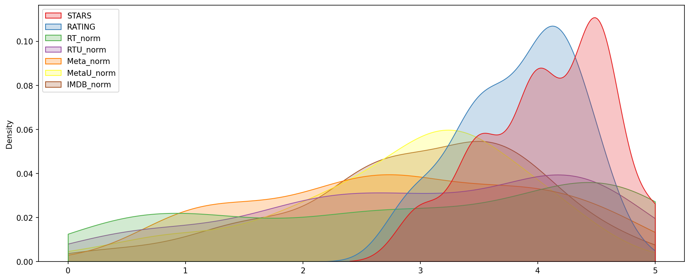

This project is the result of an exploratory analysis training on the site: <em>Copyright by Pierian Data Inc.</em>
<em>For more information, visit us at <a href='http://www.pieriandata.com'>www.pieriandata.com</a></em> 
# EXAMINING THE INFLUENCE OF ONLINE MOVIE RATINGS ON TICKET SALES
## Overview
When considering heading out to watch a film, can you rely on online reviews and ratings, particularly if the platform providing the rating also profits from ticket sales? Is there a tendency for them to inflate ratings, potentially skewing perceptions of a movie's quality?

## Goal
The objective is to respond to this question using the information provided in the 538 article and ascertain if Fandango's movie ratings in 2015 exhibited a tendency to rate films more favorably in order to boost ticket sales. I will employ my proficiency in data visualization to analyze whether such bias exists.
article: [Be Suspicious Of Online Movie Ratings, Especially Fandango’s](http://fivethirtyeight.com/features/fandango-movies-ratings/)

## Data source
There are two csv files, one with Fandango Stars and Displayed Ratings, and the other with aggregate data for movie ratings from other sites, like Metacritic,IMDB, and Rotten Tomatoes. 
`all_sites_scores.csv` contains every film that has a Rotten Tomatoes rating, a RT User rating, a Metacritic score, a Metacritic User score, and IMDb score, and at least 30 fan reviews on Fandango. The data from Fandango was pulled on Aug. 24, 2015.
Column | Definition
--- | -----------
FILM | The film in question
RottenTomatoes | The Rotten Tomatoes Tomatometer score  for the film
RottenTomatoes_User | The Rotten Tomatoes user score for the film
Metacritic | The Metacritic critic score for the film
Metacritic_User | The Metacritic user score for the film
IMDB | The IMDb user score for the film
Metacritic_user_vote_count | The number of user votes the film had on Metacritic
IMDB_user_vote_count | The number of user votes the film had on IMDb

`fandango_scrape.csv` contains every film 538 pulled from Fandango.

Column | Definiton
--- | ---------
FILM | The movie
STARS | Number of stars presented on Fandango.com
RATING |  The Fandango ratingValue for the film, as pulled from the HTML of each page. This is the actual average score the movie obtained.
VOTES | number of people who had reviewed the film at the time we pulled it.

## Project Steps
- Part One: Understanding the Background and Data
- Part Two: Exploring Fandango Displayed Scores versus True User Ratings
- Part Three: Comparison of Fandango Scores to Other Sites

## Summary

The x-axis shows the number of stars observed.
The y-axis shows the frequency of stars was observed.
At the end of this exploration, the graph presented here shows us that the stars and votes observed on Fandango's site follow the same trend. However, the difference between this one and the one shown on other sites indicates a problem. Additionally, the number of votes made by fans and the number of stars displayed on the site do not match, as evidenced by an offset of approximately 0.04!
Furthermore, it is noticeable that Fandango's site displays a significantly higher number of votes/stars compared to other sites (Metacritic, IMDB, and Rotten Tomatoes). Therefore, we can conclude that the Fandango's website falsifies the number of votes and stars displayed on their site to increase their ticket sales revenue.

In particular, for the movie "Taken 3," Fandango shows 4.5 stars on their site while other platforms are at 1.86.
